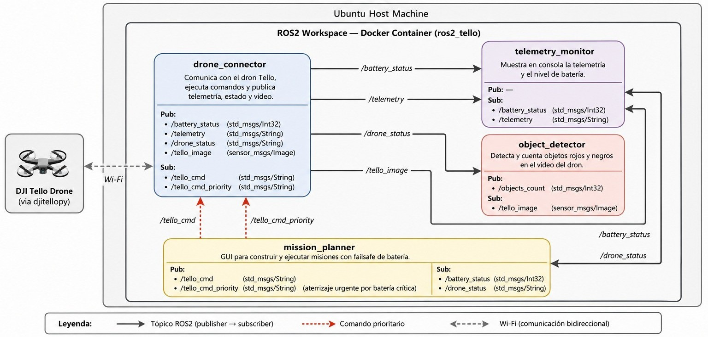

# UAV Control — DJI Tello + ROS 2 Jazzy

Sistema modular ROS 2 para control autónomo, monitoreo de telemetría y detección de objetos con el dron **DJI Tello**.



---

## Contenido del repositorio

```
uav-control/
├── src/
│   └── tello_control/
│       ├── tello_control/
│       │   ├── drone_connector.py    # Nodo 1 — Comunicación con el dron
│       │   ├── telemetry_monitor.py  # Nodo 3 — Monitor de telemetría
│       │   ├── object_detector.py    # Nodo 6 — Detección de objetos
│       │   └── mission_planner.py    # Nodo 5 — GUI de planificación de misiones
│       ├── launch/
│       │   └── tello_launch.py       # Launch file (arranca los 4 nodos)
│       ├── package.xml
│       ├── setup.py
│       └── setup.cfg
├── Dockerfile
├── docker-compose.yml
├── entrypoint.sh
└── flight_test.py                    # Script de prueba de vuelo independiente
```

---

## Nodos ROS 2

| Nodo | Ejecutable | Función |
|---|---|---|
| `drone_connector` | `drone_connector` | Conexión con el Tello vía `djitellopy`. Publica video, batería, telemetría y estado. Recibe comandos normales y prioritarios. |
| `telemetry_monitor` | `telemetry_monitor` | Muestra en consola los datos de telemetría (altura, velocidades, IMU, temperatura, etc.) en tiempo real. |
| `object_detector` | `object_detector` | Detecta objetos de color **rojo** y **negro** en el video del dron usando filtros HSV + morfología. Muestra ventana OpenCV. |
| `mission_planner` | `mission_planner` | GUI PyQt5 para diseñar y ejecutar secuencias de vuelo. Incluye failsafe automático por batería crítica. |

### Tópicos principales

| Tópico | Tipo | Dirección |
|---|---|---|
| `/tello_cmd` | `std_msgs/String` | → `drone_connector` |
| `/tello_cmd_priority` | `std_msgs/String` | → `drone_connector` (urgente) |
| `/battery_status` | `std_msgs/Int32` | `drone_connector` → |
| `/telemetry` | `std_msgs/String` (JSON) | `drone_connector` → |
| `/drone_status` | `std_msgs/String` | `drone_connector` → |
| `/tello_image` | `sensor_msgs/Image` | `drone_connector` → |
| `/drone_fps` | `std_msgs/Float32` | `drone_connector` → |
| `/objects_count` | `std_msgs/Int32` | `object_detector` → |

---

## Opción 1 — Instalación local (ROS 2 Jazzy)

### Requisitos previos

- Ubuntu 24.04 con **ROS 2 Jazzy** instalado
- Python 3.10+
- Paquetes del sistema:

```bash
sudo apt install python3-pip python3-opencv python3-pyqt5 ros-jazzy-cv-bridge
```

- Librería del dron:

```bash
pip install djitellopy
pip install "numpy<2" --force-reinstall
```

### Pasos

1. **Crea el workspace de ROS 2:**

```bash
mkdir -p ~/ros2_ws/src
cd ~/ros2_ws
```

2. **Copia los archivos del paquete:**

Copia la carpeta `src/tello_control/` de este repositorio dentro de `~/ros2_ws/src/`:

```bash
cp -r /ruta/a/uav-control/src/tello_control ~/ros2_ws/src/
```

3. **Compila el paquete:**

```bash
cd ~/ros2_ws
source /opt/ros/jazzy/setup.bash
colcon build --packages-select tello_control
```

4. **Carga el entorno:**

```bash
source ~/ros2_ws/install/setup.bash
```

5. **Conecta el Tello** a la red Wi-Fi del dron y lanza todos los nodos:

```bash
ros2 launch tello_control tello_launch.py
```

### Lanzar nodos individualmente

```bash
ros2 run tello_control drone_connector
ros2 run tello_control telemetry_monitor
ros2 run tello_control object_detector
ros2 run tello_control mission_planner
```

### Ajustar parámetros del detector en tiempo real

```bash
ros2 run tello_control object_detector \
    --ros-args -p min_area:=1500 -p black_v_max:=35
```

---

## Opción 2 — Docker Hub + Docker Compose

Esta opción no requiere tener ROS 2 instalado localmente.

### Requisitos previos

- Docker y Docker Compose instalados
- Servidor X activo (para la GUI y la ventana de video)

### Pasos

1. **Permite conexiones al servidor X:**

```bash
xhost +local:docker
```

2. **Descarga la imagen desde Docker Hub:**

```bash
docker pull miguelbermeo1/tello_ros2
```

3. **Etiqueta la imagen con el nombre que espera el Compose:**

```bash
docker tag miguelbermeo1/tello_ros2 tello_ros2:latest
```

4. **Conecta el Tello** a la red Wi-Fi del dron.

5. **Lanza el contenedor:**

```bash
docker compose up
```

Esto ejecuta automáticamente `ros2 launch tello_control tello_launch.py` dentro del contenedor.

### Acceder a una terminal interactiva en el contenedor

```bash
docker exec -it tello_drone bash
```

Dentro ya está disponible el entorno de ROS 2 y el paquete compilado.

---

## Construir la imagen localmente (opcional)

Si prefieres construir la imagen tú mismo en lugar de descargarla:

```bash
docker build -t tello_ros2:latest .
docker compose up
```

---

## Script de prueba de vuelo

`flight_test.py` es un script independiente (sin ROS) para verificar la conexión y telemetría del dron directamente con `djitellopy`:

```bash
python3 flight_test.py
```

Requiere `djitellopy` instalado y el dron conectado por Wi-Fi.

---

## Dependencias del paquete ROS 2

| Dependencia | Tipo |
|---|---|
| `rclpy` | Runtime |
| `std_msgs` | Runtime |
| `sensor_msgs` | Runtime |
| `cv_bridge` | Runtime |
| `launch` / `launch_ros` | Runtime |
| `djitellopy` | Python (pip) |
| `PyQt5` | Python (apt) |
| `opencv-python` | Python (apt) |

---

## Licencia

MIT — ver `package.xml` para detalles.

Maintainer: Miguel Bermeo — `miguel.bermeo@ucuenca.edu.ec`
